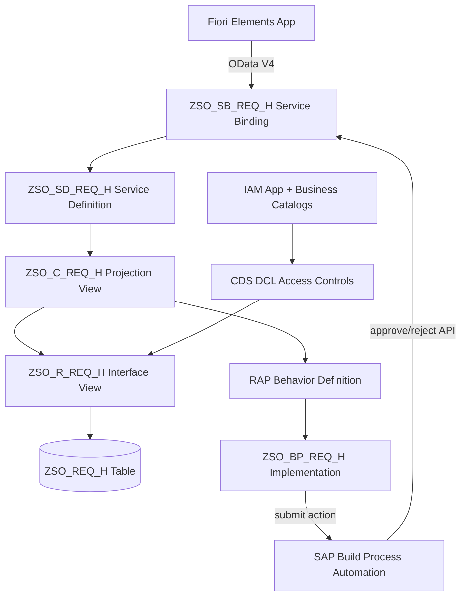
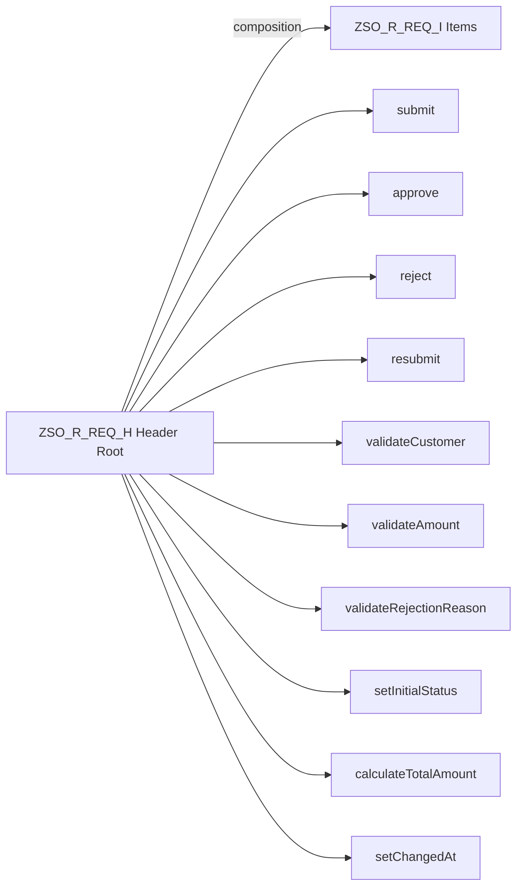
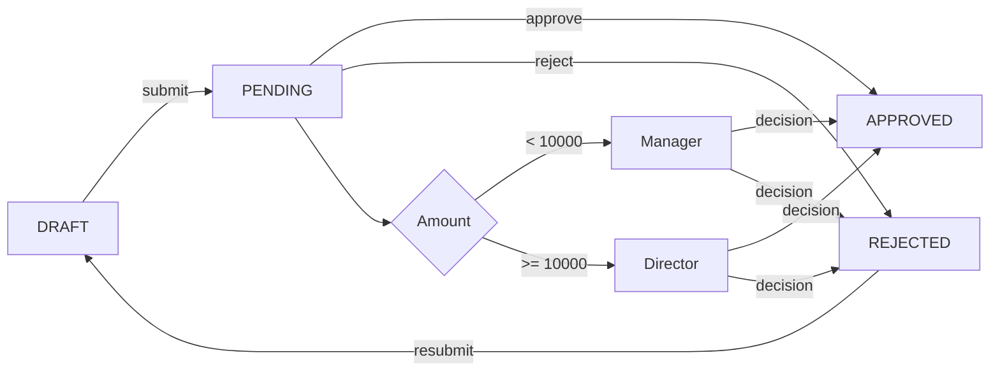

# Clean-Core Sales Order Approval App

> **SAP ABAP Cloud | RAP | CDS | OData V4 | Fiori Elements | SAP Build Process Automation**

A portfolio project demonstrating clean-core principles for the
**SAP Certified Associate - Back-End Developer - ABAP Cloud** certification.

---

## Problem Statement

Traditional SAP sales order approval processes rely on custom modifications
to standard objects, creating upgrade blockers and technical debt.
This app reimplements the same business scenario using 100% clean-core,
extensible-by-SAP-approved APIs.

---

## Architecture



---

## RAP Business Object Structure



---

## Approval Workflow



---

## Tech Stack

| Layer           | Technology                              |
|-----------------|-----------------------------------------|
| Database        | ABAP Cloud Transparent Tables           |
| Data Model      | CDS View Entities (OData V4)            |
| Business Logic  | RAP Managed BO with Draft               |
| API Layer       | OData V4 Service Binding                |
| Frontend        | SAP Fiori Elements (List Report + OP)   |
| Workflow        | SAP Build Process Automation            |
| Authorization   | CDS DCL + IAM App + Auth Object         |
| Tests           | ABAP Unit (CL_ABAP_UNIT_ASSERT)         |

---

## Features

- Create, update, and submit sales order requests with draft editing support
- Multi-level approval routing based on total amount threshold (Manager/Director)
- Instance-based authorization: requesters see only their requests, approvers see assigned requests
- Rejection with mandatory reason + resubmission capability
- Fiori Elements UI with status-driven action button visibility
- ABAP Unit test suite with >= 80% coverage
- 100% ABAP Cloud compliant - zero modifications to standard SAP objects

---

## Object Inventory

### Database Layer
| Object         | Type              | Description              |
|----------------|-------------------|--------------------------|
| ZSO_REQ_H      | Transparent Table | Request header           |
| ZSO_REQ_I      | Transparent Table | Request items            |
| ZSO_D_STATUS   | Domain            | Status fixed values      |
| ZSO_E_STATUS   | Data Element      | Status type              |

### CDS Layer
| Object         | Type              | Description              |
|----------------|-------------------|--------------------------|
| ZSO_R_REQ_H    | Interface View    | Header root entity       |
| ZSO_R_REQ_I    | Interface View    | Item child entity        |
| ZSO_C_REQ_H    | Projection View   | Header with UI annots    |
| ZSO_C_REQ_I    | Projection View   | Items with UI annots     |

### RAP Layer
| Object         | Type              | Description              |
|----------------|-------------------|--------------------------|
| ZSO_R_REQ_H    | Behavior Def      | Root BO behavior         |
| ZSO_BP_REQ_H   | Impl Class        | Behavior implementation  |
| ZSO_P_REJECT   | Action Parameter  | Reject reason input      |

### Service Layer
| Object         | Type              | Description              |
|----------------|-------------------|--------------------------|
| ZSO_SD_REQ_H   | Service Definition| OData V4 exposure        |
| ZSO_SB_REQ_H   | Service Binding   | OData V4 UI binding      |

### Authorization
| Object         | Type              | Description              |
|----------------|-------------------|--------------------------|
| ZSO_APPROVAL   | Auth Object       | Approval auth checks     |
| ZSO_BC_REQUESTER| Business Catalog | Requester catalog        |
| ZSO_BC_APPROVER | Business Catalog | Approver catalog         |
| ZSO_BC_ADMIN   | Business Catalog  | Admin catalog            |

---

## Setup Instructions

### Prerequisites
- SAP BTP Trial account with ABAP environment (BTP ABAP trial)
- SAP Business Application Studio (BAS) or VS Code with ADT extension
- abapGit plugin for version control

### Steps
1. Clone this repository and open in Antigravity IDE
2. Connect to your BTP ABAP environment via ADT
3. Create package Z_SALES_APPROVAL and a transport request
4. Execute Day 1-7 prompts from the abap/ and fiori/ directories in order
5. Publish the service binding ZSO_SB_REQ_H
6. Deploy the Fiori app from BAS to your launchpad
7. Configure business roles in BTP cockpit
8. Set up the SBPA workflow and connect to the OData V4 service

---

## How to Run Tests

In Antigravity Agent Manager:
```
/build-feature create-authorization-and-tests
```

Or directly in ADT:
- Right-click ZSO_TEST_REQ_H -> Run As -> ABAP Unit Test
- View coverage in the ABAP Unit Result view

---

## Clean-Core Principles

This project follows SAP's clean-core guidelines:
- **No modifications** to standard SAP objects (no enhancements, no includes)
- **Released APIs only** - all classes and FMs verified against ABAP Cloud release state
- **ATC compliant** - passes ABAP Cloud ruleset with zero violations
- **Extensible** - custom objects use SAP-approved extension points
- **Upgrade-safe** - zero risk from SAP standard upgrades

---

## Resume Bullets

- Developed a clean-core Sales Order Approval app using RAP managed BO with draft, CDS view entities, OData V4 service binding, and SAP Fiori Elements, following 100% ABAP Cloud compliance verified by ATC checks
- Implemented instance-based authorization using CDS DCL access controls and IAM app configuration with three distinct business roles (Requester, Approver, Admin), enforcing data visibility at the database layer
- Designed and integrated a multi-level SAP Build Process Automation workflow triggered by a RAP custom action, routing approvals based on total order amount with full rejection/resubmission handling
- Achieved 80%+ ABAP Unit test coverage on all business logic using CL_ABAP_UNIT_ASSERT and ABAP Test Double Framework, covering 15+ test cases across validations, determinations, and actions
- Demonstrated clean-core best practices by implementing all customizations exclusively in the customer namespace (Z_SALES_APPROVAL package) with zero modifications to standard SAP objects

---

## Author

**[Your Name]**
SAP Certified Associate - Back-End Developer - ABAP Cloud (in progress)

---

## License

MIT
