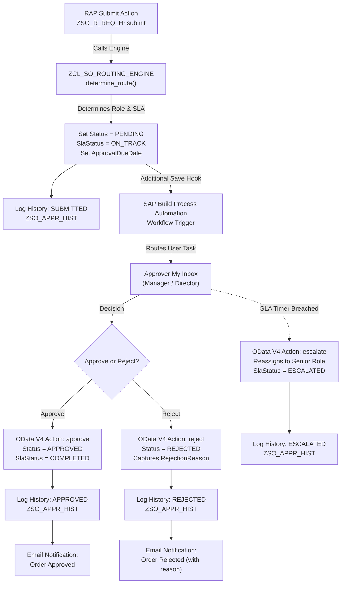

# Clean-Core Sales Order Approval App

[](https://www.sap.com/)
[-brightgreen.svg)](https://community.sap.com/)
[](https://odata.org/)
[](https://experience.sap.com/fiori-design/)
[](https://www.sap.com/)

An enterprise-grade reference application demonstrating clean-core principles on SAP BTP and SAP S/4HANA Cloud, built to the standards of the **SAP Certified Associate – Back-End Developer – ABAP Cloud** certification.

---

## 🏢 Business Problem

In traditional on-premise SAP implementations, sales order approvals frequently rely on intrusive modifications to standard objects (e.g. user exits in `MV45AFZZ`, BAdI implementations with direct database mutations, or unreleased tables like `VBAK`/`VBAP`). 

These legacy extensions create severe technical debt:
- **Upgrade Barriers**: Every S/4HANA upgrade or cloud release risks breaking custom modifications.
- **Audit Failures**: Approvals lack immutable audit trails, making retrospective forensic audits difficult.
- **Inflexible Policies**: Approval thresholds are hard-coded into ABAP logic, requiring developer transports whenever financial authority limits change.
- **Stalled Orders**: Without active SLA monitoring, orders sit in approver inboxes indefinitely with zero escalation capability.

This application re-engineers the sales order approval process into an extensible, upgrade-safe, and audit-compliant **Clean Core architecture**.

---

## ⚡ Key Capabilities

- **Sales Order Request Management**: Full draft-enabled lifecycle management (`DRAFT` &rarr; `PENDING` &rarr; `APPROVED` / `REJECTED`) with item hierarchy.
- **Configurable Approval Routing**: Dynamic threshold matrix (`ZSO_APPR_RULE`) supporting multi-tier approvals without code changes.
- **Multi-Level Approvals**: Configurable sequential approval steps (Manager &rarr; Senior Manager &rarr; Director).
- **Approval Audit History**: Append-only, tamper-proof audit trail (`ZSO_APPR_HIST`) tracking every decision point, actor, timestamp, and comment.
- **SLA Monitoring**: Automatic due date computation based on configured SLA hours, tracking health states (`ON_TRACK`, `DUE_SOON`, `BREACHED`).
- **Escalation Hierarchy**: Programmatic and workflow-driven escalation re-routing overdue approvals to senior authorities.
- **Role-Based & Instance-Based Security**: Two-tier authorization using CDS Data Control Language (DCL) and server-side RAP runtime guards.
- **Fiori Elements Horizon UX**: Intuitive List Report and Object Page with visual status badges, SLA criticality, and dynamic action controls.
- **Approval Simulation**: Pre-submission routing preview providing immediate transparency into required sign-offs with zero database persistence.
- **Operational Cockpit**: Read-only analytical CDS views and charts aggregating order volumes, cycle times, and SLA compliance.
- **Advanced Automated Testing**: 30 comprehensive ABAP Unit test methods covering positive, negative, security, concurrency, and routing scenarios.
- **100% Clean Core Compliance**: Built exclusively with ABAP Cloud syntax, released APIs (`I_Customer`), and zero modification of standard SAP tables.

---

## 🏛️ Architecture

### 1. Application Layer Architecture
```mermaid
graph TD
    FE["SAP Fiori Elements (V4)<br/>List Report & Object Page"]
    -->|OData V4 HTTP| SB["Service Binding (OData V4 - UI)<br/>ZSO_SB_REQ_H"]

    SB --> SD["Service Definition<br/>ZSO_SD_REQ_H"]
    SD --> C_H["Projection View (Header)<br/>ZSO_C_REQ_H"]
    SD --> C_I["Projection View (Items)<br/>ZSO_C_REQ_I"]
    SD --> C_HIST["Projection View (History)<br/>ZSO_C_REQ_HIST"]
    SD --> C_COCKPIT["Operational Cockpit<br/>ZSO_C_REQ_ANALYTICS"]

    C_H --> R_H["Interface View (Header)<br/>ZSO_R_REQ_H"]
    C_I --> R_I["Interface View (Items)<br/>ZSO_R_REQ_I"]
    C_HIST --> R_HIST["Interface View (History)<br/>ZSO_R_REQ_HIST"]

    R_H -->|Composition [1..*]| R_I
    R_H -->|Composition [0..*]| R_HIST

    R_H -.-> BDEF["RAP Behavior Definition<br/>ZSO_R_REQ_H (Managed with Draft, Strict 2)"]
    BDEF -.-> BIMPL["Behavior Implementation Class<br/>ZSO_BP_REQ_H"]

    BIMPL --> ENGINE["Domain Routing Engine<br/>ZCL_SO_ROUTING_ENGINE"]
    ENGINE --> RULES[("Configuration Rules Table<br/>ZSO_APPR_RULE")]

    DCL["CDS DCL Access Control<br/>ZSO_R_REQ_H.dcl"] --> R_H
    AUTH_OBJ["Authorization Object<br/>ZSO_APPROVAL"] --> DCL

    R_H --> TAB_H[("Header Table<br/>ZSO_REQ_H")]
    R_I --> TAB_I[("Item Table<br/>ZSO_REQ_I")]
    R_HIST --> TAB_HIST[("Audit History Table<br/>ZSO_APPR_HIST")]
```

### 2. Approval Lifecycle & Workflow Orchestration


---

## 💻 Technical Stack

| Layer | Technologies & Artifacts |
|---|---|
| **Frontend** | SAP Fiori Elements (OData V4 List Report + Object Page), SAP Horizon Morning Theme, UI5 Tooling |
| **Service Layer** | OData V4 UI Service Binding (`ZSO_SB_REQ_H`), Service Definition (`ZSO_SD_REQ_H`) |
| **Business Logic** | ABAP RESTful Application Programming Model (RAP), Managed with Draft, `strict(2)`, Determinations, Validations, Custom Actions |
| **Domain Engine** | ABAP Cloud Class `ZCL_SO_ROUTING_ENGINE` (Single Source of Truth for live routing, simulation, and rule validation) |
| **CDS Modernization** | CDS View Entities (`define view entity`), Semantic Criticality Expressions, Aggregation Cubes (`@Analytics.dataCategory: #CUBE`) |
| **Security & DCL** | CDS Data Control Language (DCL) instance authorization (`@MappingRole: true`, `aspect pfcg_auth`), SU21 Authorization Object `ZSO_APPROVAL` |
| **Persistence** | Transparent Tables (`ZSO_REQ_H`, `ZSO_REQ_I`, `ZSO_APPR_RULE`, `ZSO_APPR_HIST`), Draft Shadow Tables (`sych_bdl_draft_admin_inc`) |
| **Process Layer** | SAP Build Process Automation (SBPA) externalized task forms, context mapping, timer boundary escalations |
| **Quality & Testing** | 30 ABAP Unit test methods (`cl_abap_behv_test_environment`, `cl_abap_unit_assert`), ATC check variant `ABAP_CLOUD_READINESS` |

---

## 🔒 Security Architecture

The application enforces a two-tier security model:
1. **Database Layer (CDS DCL)**: Automatically injects SQL filters so that Requesters only see orders where `CreatedBy = $user`, and Approvers only see orders where `Approver = $user`.
2. **Business Object Layer (RAP)**: `get_instance_authorizations` validates user permissions server-side before executing any write or action. Attempts to call OData actions directly via HTTP without appropriate privileges are rejected with HTTP 403.

---

## 🧪 Automated Testing Suite

The project includes **30 automated tests** in [abap/rap/src/tests/ZSO_TEST_REQ_H.clas.testclasses.abap](file:///c:/Users/letsm/Downloads/SAP%20PROJECT/abap/rap/src/tests/ZSO_TEST_REQ_H.clas.testclasses.abap):
- **Validation Tests**: Positive amounts, zero amount rejection, negative amount rejection, customer validation, rejection reason checks.
- **State Transition Tests**: Guarding against illegal transitions (cannot approve draft, cannot reject approved, cannot resubmit pending).
- **Routing Engine Tests**: Threshold tier boundary verification, overlapping rule detection, fallback stability.
- **SLA & Escalation Tests**: Due date calculation, escalation level incrementing, role re-assignment.
- **Security & Authorization Tests**: Unauthorized user action blockage, instance isolation verification.
- **Simulation Tests**: Pre-submission route preview verification with zero database writes.

---

## 📸 Enterprise Screen Previews & Architecture Views

### 1. Approval Cockpit (Operational Dashboard)

*Real-time executive cockpit displaying total order volumes, pending bottlenecks, and active SLA breach counters.*

### 2. Request List Report

*Fiori Elements List Report featuring multi-status filtering, customer search, amount ranges, semantic status badges, and SLA health indicators.*

### 3. Request Object Page

*Detailed sales order view with header KPIs, customer information, line item table, and dynamically feature-controlled action toolbar.*

### 4. Approval Simulation

*Pre-submission preview revealing the exact required approval ladder and SLA target before committing the request into workflow.*

### 5. Approval History & Audit Trail

*Sequential, append-only timeline documenting submission, approver review, rejection notes, and escalation events.*

### 6. Admin Approval Rules Matrix

*Configuration interface allowing authorized administrators to maintain amount thresholds, approval tiers, and SLA duration hours.*

### 7. Process Automation Workflow

*SAP Build Process Automation process diagram illustrating gateway routing, task forms, and boundary timer escalations.*

### 8. Analytics & Reporting

*Dimensional breakdown of order volumes by customer, approval turnaround times, and rejection categories.*

---

## 🎬 End-to-End Business Demo Scenario

```
1. CREATE DRAFT
   Sales Rep 'JSMITH' opens the app, creates a new request for 'Acme Industrial Corp'
   Adds Item: 10 x MAT-PUMP-HD @ 1,500.00 EUR = 15,000.00 EUR Total.
   Status = DRAFT, SlaStatus = ON_TRACK.

2. RUN SIMULATION
   Sales Rep clicks 'Simulate Approval'.
   Engine returns: "Amount requires Level 01: SENIOR_MANAGER Approval (SLA: 48h)".
   No database records are created.

3. SUBMIT REQUEST
   Sales Rep clicks 'Submit'.
   RAP submit action calls ZCL_SO_ROUTING_ENGINE.
   Status becomes PENDING, Approver set to 'SRM_MUELLER', ApprovalDueDate set to +48h.
   Audit History records Step 1: SUBMITTED by JSMITH.
   Workflow is triggered asynchronously.

4. SLA MONITORING & ESCALATION
   Approver 'SRM_MUELLER' is out of office; 48 hours pass.
   System/SBPA triggers 'escalate' action.
   SlaStatus changes to ESCALATED, EscalationLevel = 1, Approver reassigned to 'DIR_SCHMIDT'.
   Audit History records Step 2: ESCALATED by SYSTEM.

5. REVIEW & APPROVE
   Director 'DIR_SCHMIDT' logs into Fiori Launchpad, opens the order.
   Reviews General Info, Line Items, and past Escalation History.
   Clicks 'Approve'.
   Status becomes APPROVED, SlaStatus becomes COMPLETED.
   Audit History records Step 3: APPROVED by DIR_SCHMIDT.
   Requester receives confirmation email.
```

---

## 📖 Enterprise Engineering Documentation

Complete technical specifications and architecture guides:
- **Core Architecture & Baseline**: [Current State Assessment](docs/current-state.md) | [State Machine & Idempotency](docs/state-machine.md)
- **Extensibility & Governance**: [Approval Routing Matrix](docs/approval-routing.md) | [Approval History Architecture](docs/decisions/ADR-002-approval-history.md) | [SLA Management & Escalation](docs/sla-and-escalation.md)
- **Integration & Resilience**: [Business Events Specification](docs/business-events.md) | [Fault Tolerance & Error Recovery](docs/error-handling.md) | [Master Data Integration](docs/master-data-integration.md) | [Notification Design](docs/notifications.md)
- **Quality & Operations**: [Security & Attack Surface Audit](docs/security-review.md) | [Concurrency & Locking](docs/concurrency.md) | [Performance Optimization Audit](docs/performance.md) | [Operations & Support SOPs](docs/operations.md)
- **DevOps & Clean Core**: [CI/CD & Deployment Pipeline](docs/ci-cd.md) | [Final Clean Core Audit](docs/clean-core-final-review.md) | [Architecture Decision Records (ADRs)](docs/decisions/)
- **Interview & Presentation**: [Master Interview Defense Package](docs/interview-guide.md) | [5-Minute Demo Script](docs/interview-demo.md) | [Seed Data Catalog](docs/demo-data.md) | [SAP BTP Deployment Guide](SAP_BTP_DEPLOYMENT_GUIDE.md)

---

## 📄 License
This project is licensed under the Apache 2.0 License.
