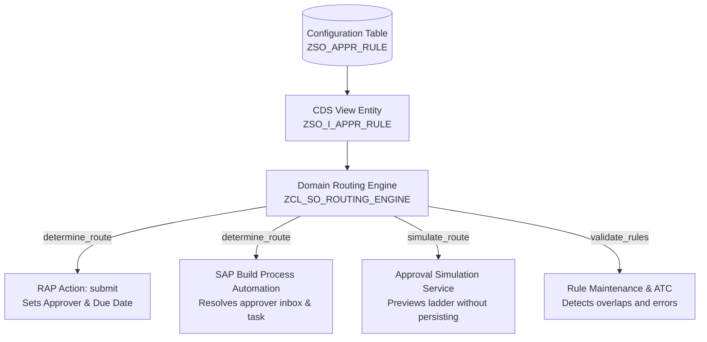

# Configurable Approval Routing Matrix

## 1. Overview & Business Problem

In enterprise sales operations, approval thresholds frequently change due to organizational restructuring, revised delegation of authority policies, inflation, or seasonal audit mandates. 

Hard-coding thresholds (such as `TotalAmount >= 10000` into ABAP `IF/ELSE` branches or workflow gateway conditions) violates **Clean Core** extensibility principles. Any business threshold revision would require ABAP developer intervention, code edits, quality assurance re-certification, and transports through DEV → QAS → PRD environments.

This enhancement introduces a **configuration-driven approval matrix** backed by database table `ZSO_APPR_RULE`, CDS interface view `ZSO_I_APPR_RULE`, and the centralized domain component `ZCL_SO_ROUTING_ENGINE`.

---

## 2. Configuration Data Model (`ZSO_APPR_RULE`)

The transparent table `ZSO_APPR_RULE` provides multi-tier, multi-level approval definitions:

```
┌────────────────────────────────────────────────────────────────────────┐
│                        ZSO_APPR_RULE                                   │
├─────────────────┬──────────────┬───────────────────────────────────────┤
│ Field           │ Type         │ Description                           │
├─────────────────┼──────────────┼───────────────────────────────────────┤
│ MANDT           │ MANDT        │ Client                                │
│ RULE_ID         │ CHAR(10)     │ Primary Key (e.g. RULE_01, RULE_02)   │
│ APPROVAL_LEVEL  │ NUMC(2)      │ Sequence Level (01=1st, 02=2nd, etc.) │
│ MIN_AMOUNT      │ CURR(15,2)   │ Range lower bound                     │
│ MAX_AMOUNT      │ CURR(15,2)   │ Range upper bound (0 = unlimited)     │
│ CURRENCY        │ CUKY(5)      │ Currency key (e.g. EUR, USD)          │
│ APPROVER_ROLE   │ CHAR(20)     │ MANAGER, SENIOR_MANAGER, DIRECTOR     │
│ APPROVER_USER   │ CHAR(12)     │ Fallback user or group queue          │
│ SLA_HOURS       │ INT4         │ Allowed processing time in hours      │
│ IS_ACTIVE       │ CHAR(1)      │ Active flag ('X' or space)            │
│ VALID_FROM      │ DATS         │ Date validity start                   │
│ VALID_TO        │ DATS         │ Date validity end                     │
│ CREATED_BY/AT   │ SYUNAME/UTC  │ Audit tracking                        │
│ CHANGED_BY/AT   │ SYUNAME/UTC  │ Audit tracking                        │
└─────────────────┴──────────────┴───────────────────────────────────────┘
```

---

## 3. Configured Threshold Tiers

The baseline enterprise matrix is configured as follows:

| Rule ID | Amount Range | Approver Role | Default Approver | SLA Target | Approval Level |
|---|---|---|---|---|---|
| `RULE_01` | 0.00 – 9,999.99 EUR | `MANAGER` | `MGR_BAUER` | 24 Hours | 01 |
| `RULE_02` | 10,000.00 – 49,999.99 EUR | `SENIOR_MANAGER` | `SRM_MUELLER` | 48 Hours | 01 |
| `RULE_03` | 50,000.00+ EUR | `DIRECTOR` | `DIR_SCHMIDT` | 72 Hours | 01 |

---

## 4. Single Source of Truth: `ZCL_SO_ROUTING_ENGINE`

To prevent duplication and rule divergence, **one shared domain component** manages all approval routing decisions across the enterprise:



### Architectural Benefits:
1. **Zero Duplication**: The RAP BO `submit` action, the SBPA process, and the Approval Simulation UI all call the identical method `zcl_so_routing_engine=>determine_route( )`.
2. **Dynamic Multi-Level Extensibility**: Additional levels (e.g. Finance review after Director approval) can be inserted simply by adding rows with `APPROVAL_LEVEL = 02` without changing any ABAP code.
3. **Graceful Fallback**: If the configuration table is empty (e.g., during isolated ABAP Unit tests), `get_fallback_rules( )` guarantees predictable execution.

---

## 5. Built-in Configuration Validations

The engine enforces five integrity checks on the rules:
1. **Range Check**: Ensures `min_amount <= max_amount`.
2. **Mandatory Role Check**: Ensures `approver_role` is not initial.
3. **Overlap Detection**: Scans rules within the same `approval_level` and `currency` to prevent conflicting assignments.
4. **SLA Validation**: Warns if SLA duration is non-positive.
5. **Temporal Validity**: Filters rules based on system date vs `valid_from` and `valid_to`.
