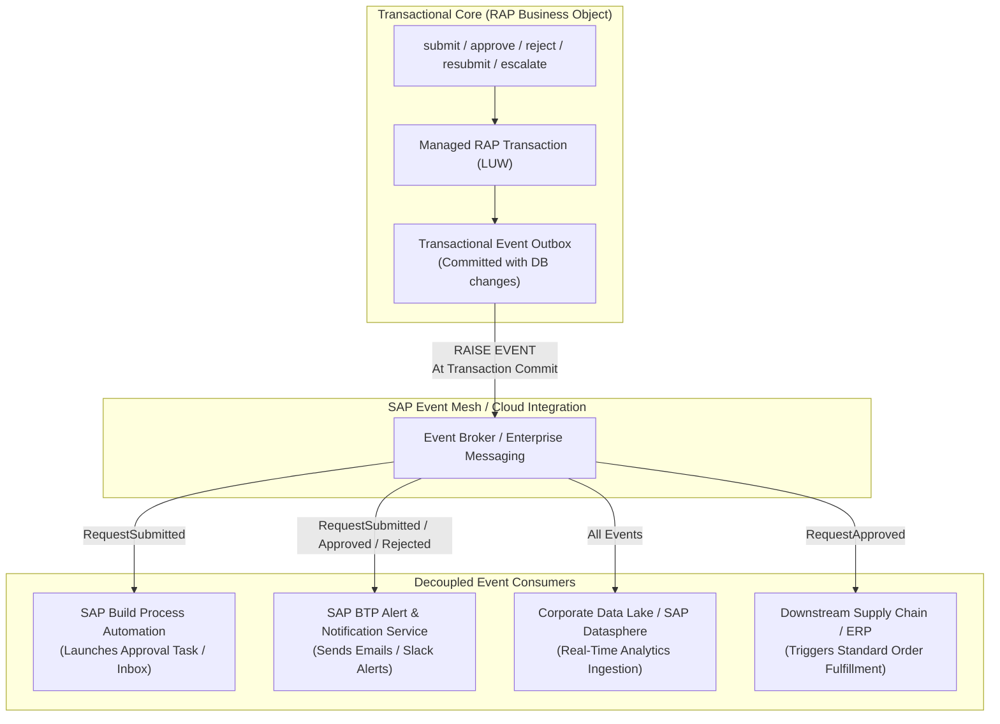

# Business Events & Event-Driven Architecture

## 1. Overview & Architectural Motivation

In modern cloud landscapes, tight point-to-point synchronous coupling between business applications creates brittle dependencies, cascading latency, and upgrade bottlenecks. 

Rather than having the RAP Business Object directly invoke external notification APIs, workflow triggers, and analytics pipelines within the synchronous transactional phase, the **Clean-Core Sales Order Approval App** introduces **native RAP Business Events** (`SAP Event Mesh` / CloudEvents compliant).

---

## 2. Event-Driven Architecture Diagram



---

## 3. Catalog of Business Events

All events share the standardized payload structure defined in [`ZSO_E_EVT_PAYLOAD`](file:///c:/Users/letsm/Downloads/SAP%20PROJECT/abap/rap/src/ZSO_E_EVT_PAYLOAD.ddls.asddls):

| Event Name | Producer Action | Trigger Condition | Primary Consumers | Business Intent |
|---|---|---|---|---|
| `RequestSubmitted` | `submit` | Order transitions `DRAFT` &rarr; `PENDING` | SAP Build Process Automation, Notification Service | Initiates approver task, routes task to assigned manager, sends submission acknowledgment to requester. |
| `RequestApproved` | `approve` | Order transitions `PENDING` &rarr; `APPROVED` | ERP Fulfillment, Requester Notification, Analytics | Initiates downstream sales order release in S/4HANA core, notifies requester of approval. |
| `RequestRejected` | `reject` | Order transitions `PENDING` &rarr; `REJECTED` | Requester Notification, Audit Archival | Alerts requester with mandatory rejection reason; closes active workflow tasks. |
| `RequestResubmitted` | `resubmit` | Order transitions `REJECTED` &rarr; `PENDING` | SBPA Workflow, Approver Notification | Re-evaluates routing matrix and creates new approval task for reassigned role. |
| `RequestEscalated` | `escalate` | Order escalated due to SLA breach | Senior Leadership Alert, Escalation Manager | Reassigns pending task in My Inbox to director/senior manager queue; logs SLA breach alert. |

---

## 4. Transaction Consistency & The Outbox Pattern

A fundamental risk in distributed architectures is **split-brain inconsistency**:
- *Failure Mode*: If an ABAP transaction publishes an HTTP event to an external broker and then encounters a database commit failure, external systems react to a transaction that never officially occurred.
- *Clean Core Solution*: RAP business events are **transactionally bound** to the database commit. Events declared in the BDEF and raised via `RAISE EVENT` are staged in the local transactional outbox. They are dispatched to SAP Event Mesh **only after the database commit succeeds**. If the LUW rolls back, the events are discarded.

---

## 5. Event Payload Schema (`ZSO_E_EVT_PAYLOAD`)

```json
{
  "specversion": "1.0",
  "type": "com.company.salesorder.RequestApproved.v1",
  "source": "/default/sap.s4.beh/SalesOrderRequest",
  "id": "e8a1f72a-1945-4df3-b3c9-953e6b12a0f1",
  "time": "2026-10-02T02:27:00Z",
  "datacontenttype": "application/json",
  "data": {
    "RequestId": "SO-2026-0001",
    "CustomerId": "CUST-1001",
    "TotalAmount": 14500.00,
    "Currency": "EUR",
    "Status": "APPROVED",
    "Approver": "SRM_MUELLER",
    "EventTimestamp": "2026-10-02T02:27:00Z",
    "RejectionReason": "",
    "EscalationLevel": 0
  }
}
```
