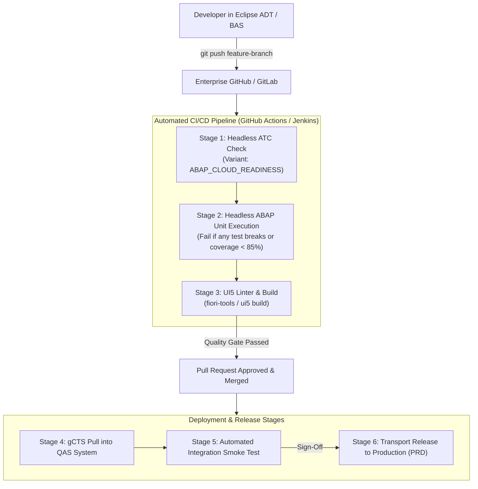

# CI/CD, Quality Gates & Deployment Lifecycle Pipeline

## 1. Overview & Modern ABAP DevOps

Clean Core engineering requires shifting quality assurance **left**: catching syntax errors, unreleased API violations, security flaws, and regression defects prior to deploying ABAP software components across enterprise landscapes.

This document contrasts the **Current Project Implementation** against the **Recommended Enterprise CI/CD Pipeline**.

---

## 2. Pipeline Comparison

| Pipeline Stage | Current Implementation (Local / Workspace) | Recommended Enterprise Pipeline (gCTS / Jenkins / BTP) |
|---|---|---|
| **Source Control** | Git repository tracked locally with GitHub mirror. | **Git-Enabled Change & Transport System (gCTS)** or **abapGit** integrated with enterprise GitHub / GitLab. |
| **Branching Strategy** | Trunk development / main branch. | **Feature Branching (GitFlow)**: `feature/*` &rarr; PR with automated checks &rarr; `main` &rarr; Release tags. |
| **Static Code Quality** | Manual Eclipse ADT syntax validation and Clean Core checks. | Automated **ABAP Test Cockpit (ATC)** headless execution via `atc-cli` / Jenkins / GitHub Actions. |
| **Automated Testing** | 30 ABAP Unit test methods executed in Eclipse ADT or local double. | Automated **ABAP Unit Regression Suite** run on every pull request; blocks merge if coverage < 85%. |
| **Artifact Packaging** | File-based ABAP source definitions (`.asddls`, `.asdbtab`, `.asbdef`, `.abap`). | Standard **SAP Software Components (ZLOCAL / Custom SWC)** imported via gCTS / transport requests. |
| **Frontend CI/CD** | Manual `npm run build` and `npm run deploy` via CF CLI. | **SAP Continuous Integration and Delivery (BTP CI/CD)** automated MTA build & deploy to HTML5 repo. |
| **Transport Management**| Single initial Transport Request (`Z_SALES_APPROVAL`). | Standard 3-tier SAP Transport Landscape: Development (DEV) &rarr; Quality Assurance (QAS) &rarr; Production (PRD). |

---

## 3. Recommended Enterprise Pipeline Architecture

---

## 4. Rollback & Disaster Recovery Strategy

In ABAP Cloud and SAP BTP:
1. **Software Component Rollback**: If a critical bug is discovered in production, gCTS allows reverting to the previous commit tag. In traditional CTS, an emergency forward-fix transport is created.
2. **Database Schema Additions**: All table enhancements (`ZSO_APPR_RULE`, `ZSO_APPR_HIST`, new SLA columns) are strictly **additive** (`@AbapCatalog.enhancement.category: #NOT_EXTENSIBLE` on custom tables, zero destructive column drops), ensuring zero data loss during rollbacks.
3. **Frontend Versioning**: SAP BTP HTML5 Application Repository maintains versioned bundles (e.g. `1.0.0`, `1.0.1`), allowing instant rollback to the previous active UI bundle via SAP Build Work Zone Site Manager.
