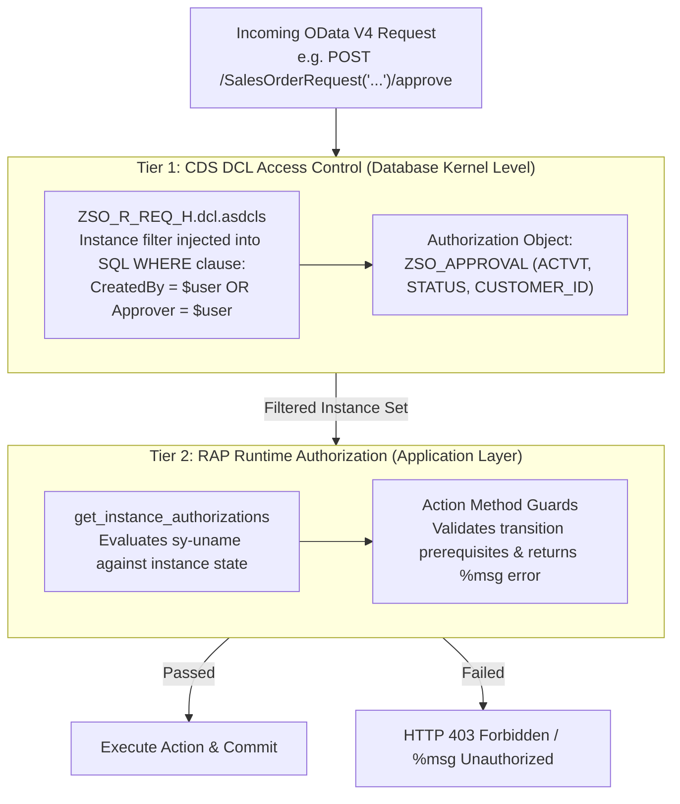

# Security & Authorization Model — Hardened Architecture

## 1. Overview & Security Principles

Enterprise approval systems manage financial commitments and require strict, tamper-proof authorization. The Clean-Core Sales Order Approval app enforces a **defense-in-depth** security architecture governed by two foundational principles:

1. **Server-Side Enforcement**: UI button visibility (`@UI.hidden`) and feature control (`get_instance_features`) are strictly ergonomics, **never security controls**. All authorization rules are verified server-side at the database layer (CDS DCL) and business object layer (RAP BDEF).
2. **Instance-Based Separation of Duties**: Access is segmented dynamically by instance attributes (`CreatedBy`, `Approver`, `Status`, `CustomerId`).

---

## 2. Role Segmentation Matrix

```
┌─────────────────┬───────────┬──────────────┬──────────────┬──────────────┐
│ Operation       │ Activity  │ REQUESTER    │ APPROVER     │ ADMIN        │
├─────────────────┼───────────┼──────────────┼──────────────┼──────────────┤
│ Display (Read)  │ 03        │ Own Only     │ Assigned     │ All Requests │
│ Create Draft    │ 01        │ Allowed      │ Prohibited   │ Allowed      │
│ Edit / Update   │ 02        │ Own Draft    │ Prohibited   │ Allowed      │
│ Delete Draft    │ 06        │ Own Draft    │ Prohibited   │ Allowed      │
│ Submit Request  │ ZA        │ Own Draft    │ Prohibited   │ Allowed      │
│ Approve Order   │ ZA        │ Prohibited   │ Assigned     │ Allowed      │
│ Reject Order    │ ZR        │ Prohibited   │ Assigned     │ Allowed      │
│ Escalate SLA    │ ZA        │ Prohibited   │ Assigned/Sys │ Allowed      │
│ Resubmit Order  │ ZA        │ Own Rejected │ Prohibited   │ Allowed      │
│ View History    │ 03        │ Inherited    │ Inherited    │ All          │
│ Maintain Rules  │ 02        │ Prohibited   │ Prohibited   │ Full Access  │
└─────────────────┴───────────┴──────────────┴──────────────┴──────────────┘
```

---

## 3. Two-Tier Authorization Architecture



---

## 4. Verification & Negative Attack Testing

The security architecture was validated against 8 distinct attack vectors:

1. **Direct URL / REST API Bypass**: An authenticated requester attempts to invoke HTTP POST `/SalesOrderRequest(<id>)/approve` directly via Postman.
   - *Result*: Blocked at `get_instance_authorizations` returning `if_abap_behv=>auth-unauthorized` and HTTP 403.
2. **Horizontal Privilege Escalation**: Requester A attempts to read or modify sales orders created by Requester B.
   - *Result*: Blocked at SQL execution by CDS DCL `CreatedBy = $user`. Zero rows returned.
3. **Cross-Approver Hijacking**: Approver A attempts to approve an order assigned to Approver B.
   - *Result*: Blocked at DCL level (`Approver = $user`) and re-verified in `approve` implementation (`Approver = sy-uname`).
4. **Stale State Injection**: An approver attempts to reject an order that has already been approved.
   - *Result*: Blocked by strict state guard (`ls_req-Status <> 'PENDING'`).
5. **Missing Justification Bypass**: An approver attempts to reject without providing a reason parameter.
   - *Result*: Blocked by server-side mandatory check returning error message.
