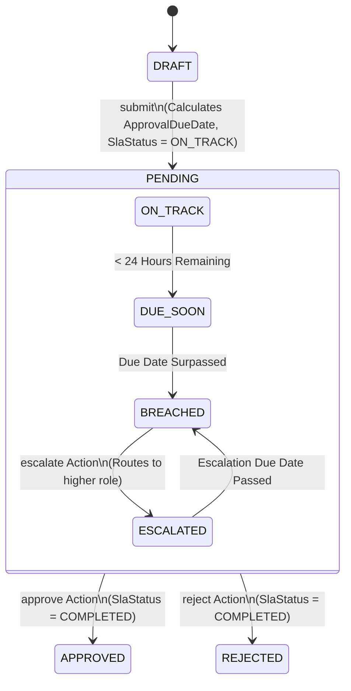

# SLA Management and Escalation Engine

## 1. Overview & Business Problem

In enterprise sales operations, high-value customer orders must not stall indefinitely waiting for managerial approval. Extended delays risk customer dissatisfaction, lost revenue, and contract penalty breaches.

This capability provides automated **Service Level Agreement (SLA) monitoring and escalation** for the Sales Order Approval application:
1. **Dynamic Target Calculation**: Calculates the approval due date and target SLA upon submission based on the configured tier (from `ZSO_APPR_RULE`).
2. **Deterministic Lifecycle States**: Tracks operational health (`ON_TRACK`, `DUE_SOON`, `BREACHED`, `ESCALATED`, `COMPLETED`).
3. **Escalation Hierarchy**: Automatically or programmatically re-assigns overdue requests to superior roles and notifies management.
4. **Append-Only Audit Trail**: Every escalation event is permanently logged in `ZSO_APPR_HIST`.

---

## 2. SLA State Machine

---

## 3. SLA Data Model Fields

The following fields are managed on `ZSO_REQ_H` and exposed through `ZSO_R_REQ_H` / `ZSO_C_REQ_H`:

| Field Name | Type | Description |
|---|---|---|
| `ApprovalDueDate` | `DATS` | Date by which the approver must act. Set automatically on submission (`RequestDate + (SlaHours / 24)`). |
| `SlaStatus` | `CHAR(12)` | Current health: `ON_TRACK`, `DUE_SOON`, `BREACHED`, `ESCALATED`, `COMPLETED`. |
| `EscalationLevel` | `NUMC(2)` | 00 = Base level, 01 = First escalation, 02 = Executive escalation. |
| `EscalatedTo` | `CHAR(12)` | User or role to whom the request was escalated. |
| `EscalatedAt` | `UTCLONG` | Timestamp of the escalation event. |
| `DaysWaiting` | Virtual (`INT4`) | Calculated dynamically in CDS via `dats_days_between(RequestDate, $session.system_date)`. |

---

## 4. Escalation Trigger Mechanisms

### Synchronous / RAP BO Level
- Action `escalate` on `ZSO_R_REQ_H`:
  - Validates that `Status = 'PENDING'`.
  - Determines the next escalation role (e.g. `MANAGER` &rarr; `SENIOR_MANAGER` &rarr; `DIRECTOR`).
  - Sets `SlaStatus = 'ESCALATED'`, increments `EscalationLevel`, updates `Approver = EscalatedTo`.
  - Records an append-only audit step in `ZSO_APPR_HIST` with action `ESCALATED`.

### Asynchronous / SAP Process Automation Level
In production, SAP Build Process Automation executes timer boundary events:
- If a user task in My Inbox exceeds `sla_hours`, the SBPA process timer triggers an external OData V4 call to `/SalesOrderRequest(<UUID>)/escalate`.
- No polling loops or busy-waits are executed inside ABAP Cloud kernel, strictly respecting Clean Core asynchronous processing guidelines.
