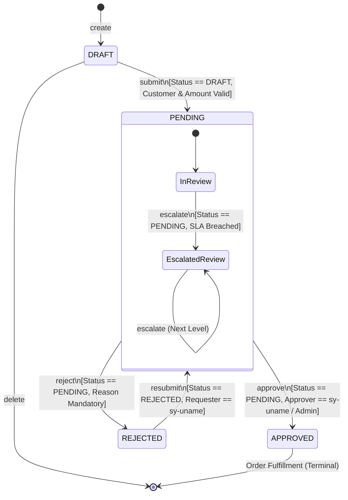

# State Machine & Action Idempotency Specification

## 1. Overview

In an enterprise sales order approval system, state transitions govern financial commitments, legal compliance, and internal controls. The application enforces a **deterministic, finite-state machine (FSM)** implemented server-side at the RAP Business Object layer.

No action relies solely on UI element visibility (`@UI.hidden`) or frontend state. Every action method in `ZSO_BP_REQ_H` validates the current instance state before applying changes, ensuring **complete idempotency** and preventing illegal or duplicate transitions.

---

## 2. State Machine Diagram

---

## 3. State Transition Matrix

The table below defines every combination of Current State and Action:

| Current Status | Action | Allowed? | Resulting Status | Business Rule & Error Response |
|---|---|---|---|---|
| **DRAFT** | `submit` | ✅ **Yes** | `PENDING` | Calculates routing tier, SLA due date, and logs `SUBMITTED` history. |
| **DRAFT** | `approve` | ❌ **No** | `DRAFT` | Rejection: *"Only PENDING requests can be approved. Current status: DRAFT."* |
| **DRAFT** | `reject` | ❌ **No** | `DRAFT` | Rejection: *"Only PENDING requests can be rejected. Current status: DRAFT."* |
| **DRAFT** | `resubmit` | ❌ **No** | `DRAFT` | Rejection: *"Only REJECTED requests can be resubmitted. Current status: DRAFT."* |
| **DRAFT** | `escalate` | ❌ **No** | `DRAFT` | Rejection: *"Draft requests cannot be escalated."* |
| **PENDING** | `submit` | ❌ **No** | `PENDING` | Rejection: *"Request has already been submitted and is currently awaiting approval."* |
| **PENDING** | `approve` | ✅ **Yes** | `APPROVED` | Validates approver identity; sets SLA to `COMPLETED`; logs `APPROVED` history. |
| **PENDING** | `reject` | ✅ **Yes** | `REJECTED` | Validates rejection reason; sets SLA to `COMPLETED`; logs `REJECTED` history. |
| **PENDING** | `resubmit` | ❌ **No** | `PENDING` | Rejection: *"Request is currently pending approval. Resubmission is only allowed for rejected orders."* |
| **PENDING** | `escalate` | ✅ **Yes** | `PENDING` | Increments `EscalationLevel`; updates `Approver` to senior role; logs `ESCALATED` history. |
| **APPROVED** | `submit` | ❌ **No** | `APPROVED` | Rejection: *"Order is already approved. Cannot resubmit an approved order."* |
| **APPROVED** | `approve` | ❌ **No** | `APPROVED` | **Idempotent Guard**: *"Order SO-XXXX is already approved. Duplicate approval ignored."* |
| **APPROVED** | `reject` | ❌ **No** | `APPROVED` | Rejection: *"Cannot reject an already approved order."* |
| **APPROVED** | `resubmit` | ❌ **No** | `APPROVED` | Rejection: *"Approved orders cannot be resubmitted."* |
| **APPROVED** | `escalate` | ❌ **No** | `APPROVED` | Rejection: *"Cannot escalate an approved order."* |
| **REJECTED** | `submit` | ❌ **No** | `REJECTED` | Rejection: *"Rejected orders must be resubmitted via 'Resubmit' action after modification."* |
| **REJECTED** | `approve` | ❌ **No** | `REJECTED` | Rejection: *"Cannot approve a rejected order. Requester must resubmit first."* |
| **REJECTED** | `reject` | ❌ **No** | `REJECTED` | **Idempotent Guard**: *"Order is already rejected."* |
| **REJECTED** | `resubmit` | ✅ **Yes** | `PENDING` | Re-evaluates routing engine; clears rejection reason; resets SLA; logs `RESUBMITTED` history. |
| **REJECTED** | `escalate` | ❌ **No** | `REJECTED` | Rejection: *"Cannot escalate a rejected order."* |

---

## 4. External Callback & Workflow Idempotency

When integrating with external workflow engines (such as SAP Build Process Automation) or webhook retries:
1. **Network Retries**: A network timeout between SBPA and the ABAP backend may cause the workflow to re-send an `approve` call for an order that was already committed.
2. **Duplicate Detection**: The action checks if `Status == 'APPROVED'`. If the request is already approved, the backend returns a safe, controlled message without creating duplicate history entries or secondary approval emails.
3. **ETag Protection**: Every modification checks `ChangedAt`. Concurrent modification attempts by two independent approvers will result in an HTTP 412 (Precondition Failed) for the slower transaction.
