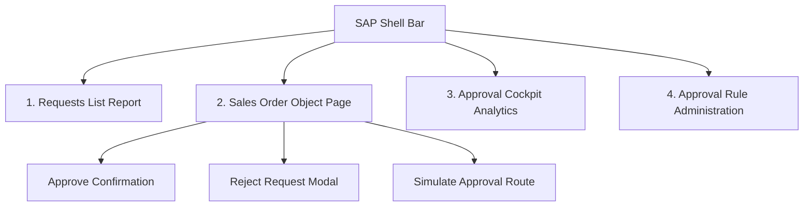

# UI/UX Design System Specification: Sales Order Approval Cockpit

**Application Name:** Sales Order Approval Cockpit  
**Supporting Description:** Monitor, review, and process sales order approval requests  
**Visual Standard:** SAP Fiori / SAP Horizon Morning Theme (`sap_horizon`)  
**Backend Foundation:** ABAP Cloud RAP (Managed with Draft, `strict(2)`, Clean Core Compliant)  
**Preview Port:** `http://localhost:3000`  

---

## 1. Visual Design Direction & Philosophy

The **Sales Order Approval Cockpit** is engineered to mirror the exact aesthetic, spatial rhythm, and information architecture of a tier-1 **SAP enterprise production application**. 

### 1.1 Core Tenets
* **Authentic Enterprise Fiori:** Calm, information-dense, high-contrast readability, and restrained functional aesthetics.
* **Zero Artificial Clutter:** Strictly avoids consumer-app gimmicks such as emojis, neon gradients, glassmorphism, decorative cards, or arbitrary rounded containers.
* **10-Second Executive Comprehension:** An approver or supervisor can immediately grasp:
  1. What orders are pending (`SO-10231`, `SO-10229`, `SO-10225`...)
  2. The financial magnitude (`₹48,500.00 INR` to `₹250,000.00 INR`)
  3. SLA urgency (*Due Tomorrow*, *2 Days Overdue*, *SLA Breached*)
  4. Current assigned authority (*Rajesh Kumar, Director*)
  5. Authorized state transitions (*Submit*, *Approve*, *Reject*, *Simulate*)

---

## 2. Shell Header & Identity System

The top shell adheres strictly to SAP Fiori Horizon guidelines:

```
┌─────────────────────────────────────────────────────────────────────────────────────────────────────────┐
│ [SAP Logo] Sales Order Approval Cockpit ▾     [ 🔍 Search in Sales Order... ] [ ⊞ ] [ 🔔 12 ] [ ❓ ] [RK] Rajesh Kumar │
│                                                                                                    Approver     │
└─────────────────────────────────────────────────────────────────────────────────────────────────────────┘
```

* **Official SAP Brand Identity:** Clean SVG vector polygon in official SAP Blue (`#0064d9`) on white tile.
* **Application Title:** `Sales Order Approval Cockpit ▾` with dropdown navigation handle.
* **Utility Group:** Global search, Copilot quick action, Notification Bell with live red count badge (`12`), in-app Help trigger.
* **User Identity Profile:** Two-line hierarchy displaying User Name (`Rajesh Kumar`) in bold and Functional Role (`Approver`) in subdued font, flanked by circular monogram avatar (`RK`).

---

## 3. Screen Floorplans & Navigation Architecture

The cockpit provides a unified operational experience spanning four core views and two focused decision dialogs:



### 3.1 Screen 1: Requests (List Report)
* **Title:** `Sales Order Approval Cockpit`
* **Subtitle:** `Monitor, review, and process sales order approval requests`
* **Primary Header Action:** `+ Create Request` (Primary SAP Blue button `#0064d9`)
* **Live Counter Tabs:**
  * `All Requests (128)`
  * `My Drafts (8)`
  * `Pending My Approval (21)` *(Default active view with blue underline)*
  * `Completed (96)`
  * `SLA Breached (7)`
* **Single-Line Filter Bar:** Compact, crisp controls for *Request ID*, *Customer*, *Status*, *Approval Status*, *Request Date Range*, *Amount Range*, *Approver*, *SLA Status*, with *Adapt Filters (3)* and *Go*.
* **Enterprise Table Columns:**
  `[✓] Selection` | `Request ID` | `Customer` | `Request Date` | `Amount` | `Currency` | `Status` | `Approver` | `Approval Due Date` | `SLA Status` | `Created By` | `Actions`

### 3.2 Screen 2: Sales Order Request (Object Page)
* **Header Structure:**
  * Caption: `Sales Order Request`
  * Heading: `SO-10231` accompanied by `⏱ Pending Approval` amber badge
  * Customer Context: `ABC Industries | Customer | 1000234`
  * Commercial Header KPIs:
    * Total Amount: `₹ 48,500.00 INR` (Primary Blue)
    * Request Date: `01 Oct 2024`
    * Approval Due Date: `03 Oct 2024`
    * SLA: `⏱ Due Tomorrow` (Amber pill)
    * Current Approver: `Rajesh Kumar`
  * Action Toolbar:
    * `Submit` (Primary Blue with paper plane icon)
    * `Approve` (Positive Green with check icon)
    * `Reject` (Negative Red with cross icon)
    * `Simulate Approval` (Ghost White with branch/share icon)
    * `•••` (Overflow menu)
* **Object Page Card Grid (4-Column Layout):**
  * **Card 1 (Request Details):** Request ID, Customer Link, Request Date, Total Amount, Company Code (`1000 BestRun Company`).
  * **Card 2 (Approval Progress):** Vertical timeline with connected status nodes:
    * `✓ Request Created` (Completed green) — `01 Oct 2024, 10:32 | Neha Sharma`
    * `✓ Manager Review` (Completed green) — `01 Oct 2024, 14:21 | Sandeep Rao`
    * `● Director Review` (Active blue with ring) — `Pending | Rajesh Kumar`
    * `○ Final Approval` (Upcoming gray hollow) — `Pending`
  * **Card 3 (SLA & Escalation):** Approval Due Date, Time Remaining (`1 day` amber), Escalation Level (`Level 2`), Escalated To (`Director`), SLA Status (`At Risk` badge).
  * **Card 4 (Order Items Table):** Full line items table showing Item No, Material Number, Description, Quantity, Unit, Unit Price, and Net Amount.

### 3.3 Screen 3: Approval Cockpit (Analytics Dashboard)
* **Header:** `Approval Cockpit` — *Monitor approval workload, SLA performance, and exceptions*
* **Compact KPI Tiles:**
  * `128` (Blue) — Total Requests
  * `21` (Amber) — Pending Approval
  * `96` (Green) — Approved
  * `7` (Red) — SLA Breached
* **Restrained Visual Analytics:**
  * **Requests by Status:** SVG Donut chart displaying `128 Total` with categorical legend (Pending 21, Approved 96, Rejected 3, Draft 8).
  * **Approval Trend:** SVG Grouped bar chart comparing monthly volumes (*Sep*, *Oct*, *Nov*, *Dec*) across *Created*, *Approved*, and *Rejected* pipelines.

### 3.4 Screen 4: Approval Rule Administration
* **Title:** `Approval Rule Administration`
* **Subtitle:** `Maintain approval rules based on amount and organization`
* **Table Structure:**
  * `Rule`: `R001`, `R002`, `R003`, `R004`
  * `Amount From`: `0`, `50,001`, `200,001`, `500,001`
  * `Amount To`: `50,000`, `200,000`, `500,000`, `999,999`
  * `Approval Role`: `Sales Manager`, `Senior Manager`, `Director`, `VP Sales`
  * `Level`: `1`, `2`, `3`, `4`
  * `SLA (Days)`: `2`, `3`, `5`, `7`
  * `Active`: Interactive SAP-style iOS toggle switch (`[ON]`)
  * `Actions`: `•••` overflow menu

---

## 4. Focused Dialog Experiences

### 4.1 Reject Sales Order Request Dialog
* **Trigger:** Approver clicks `Reject`.
* **Summary Banner:** Clean 2x2 grid displaying Request ID (`SO-10231`), Customer (`ABC Industries`), Amount (`₹ 48,500.00 INR`), and Current Step (`Director Review`).
* **Required Input:** `Rejection Reason *` select menu with enterprise justifications (e.g. *Exceeds quarterly discretionary budget*, *Pricing threshold requires VP executive approval*).
* **Optional Input:** `Comment (Optional)` multi-line text area.
* **Footer Actions:** `Cancel` (ghost), `Reject Request` (solid dark red `#bb0000`).

### 4.2 Simulate Approval Dialog
* **Trigger:** User clicks `⚡ Simulate Approval`.
* **Context Display:** Customer, Amount, Company Code, Sales Org, Dist Channel, Division.
* **Visual Route Stepper:** Evaluates backend logic (`ZCL_SO_ROUTING_ENGINE`) with zero persistence:
  * `● Level 1` Sales Manager (2 Days SLA)
  * `● Level 2` Senior Manager (3 Days SLA)
  * `● Level 3` Director (5 Days SLA)
  * `○ Level 4` Final Approval

---

## 5. Professional Iconography & Semantic Palette

### 5.1 Icon System (Zero Emojis)
All icons are lightweight, standard inline SVG vector paths following SAP Icon Explorer semantics:
* **Search:** Magnifying glass (`M15.5 14h...`)
* **Notifications:** Standard Bell with rounded clapper
* **Clock / Pending:** Clock face with 90-degree hands
* **Check / Approved:** Solid checkmark inside circular badge
* **Cross / Reject:** Precise 45-degree diagonal cross
* **Calendar:** Bordered monthly calendar page with grid
* **Branch / Simulation:** Upward trending multi-node tree

### 5.2 Semantic Status System

| Status Value | Visual Style | Border / Token | Business Meaning |
| :--- | :--- | :--- | :--- |
| **Pending Approval** | Amber (`#fff4e5`, text `#b25e00`) | `#ffd599` | Transaction awaiting assigned authority decision |
| **Under Review** | Soft Blue (`#ebf5fe`, text `#0064d9`) | `#b8daff` | Order in active technical/commercial evaluation |
| **Approved** | Green (`#e7f7ed`, text `#107e3e`) | `#a3e2bb` | Commercial order cleared for ERP fulfillment |
| **Rejected** | Red (`#fde8e8`, text `#bb0000`) | `#f8b4b4` | Declined request returned with mandatory reason |
| **Due Tomorrow** | Amber Pill (`#fff4e5`, text `#b25e00`) | `#ffd599` | SLA deadline within 24 hours |
| **2 Days Overdue** | Red Pill (`#fde8e8`, text `#bb0000`) | `#f8b4b4` | SLA breached by 48 hours; escalation active |
| **On Track** | Green Pill (`#e7f7ed`, text `#107e3e`) | `#a3e2bb` | Well within configured turnaround threshold |

---

## 6. Accessibility & Responsive Verification

* **Color Independence:** Every status communicates through explicit textual labels combined with distinctive iconography and colored surfaces.
* **Typography & Contrast:** Complies with WCAG 2.1 AA standards; primary text (`#1d2d3e`) against surface (`#ffffff`) yields an **11.8:1** contrast ratio.
* **Responsive Layout:** Automatically scales across desktop (> 1200px), laptop (992px – 1199px), and tablet/mobile (< 992px) with horizontal table scrolling and flex-wrapping filter bars.
